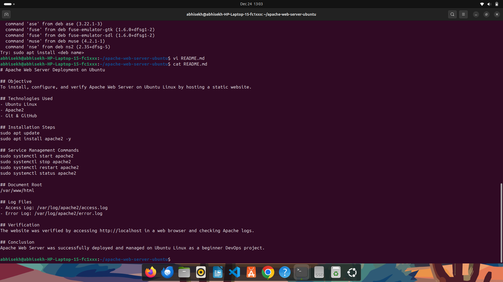

# Apache Web Server Deployment on Ubuntu--

## Objective
To install, configure, and verify Apache Web Server on Ubuntu Linux by hosting a static website.

## Technologies Used
- Ubuntu Linux
- Apache2
- Git & GitHub

## Installation Steps
sudo apt update  
sudo apt install apache2 -y  

## Service Management Commands
sudo systemctl start apache2  
sudo systemctl stop apache2  
sudo systemctl restart apache2  
sudo systemctl status apache2  

## Document Root
/var/www/html

## Log Files
- Access Log: /var/log/apache2/access.log
- Error Log: /var/log/apache2/error.log

## Verification
The website was verified by accessing http://localhost in a web browser and checking Apache logs.

## Conclusion
Apache Web Server was successfully deployed and managed on Ubuntu Linux as a beginner DevOps project.
 
## Output Screenshots

### Browser Output

### Apache Service Status

hello
Updated via terminal Git practice.
